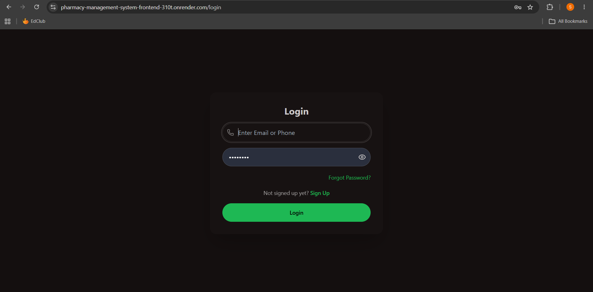
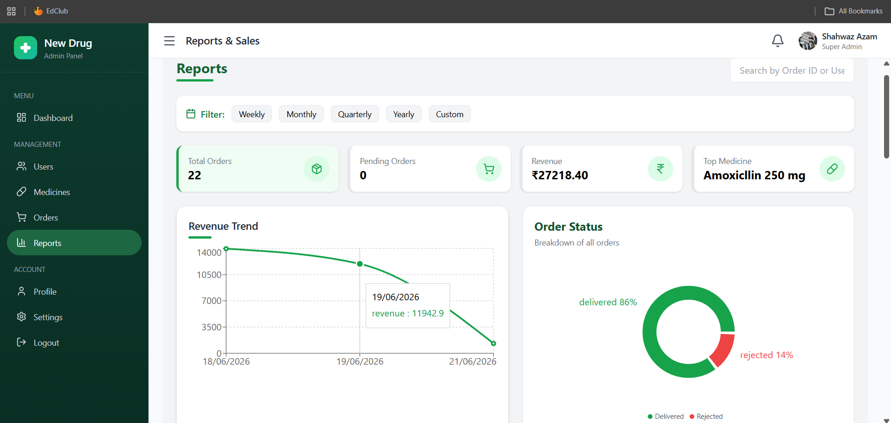
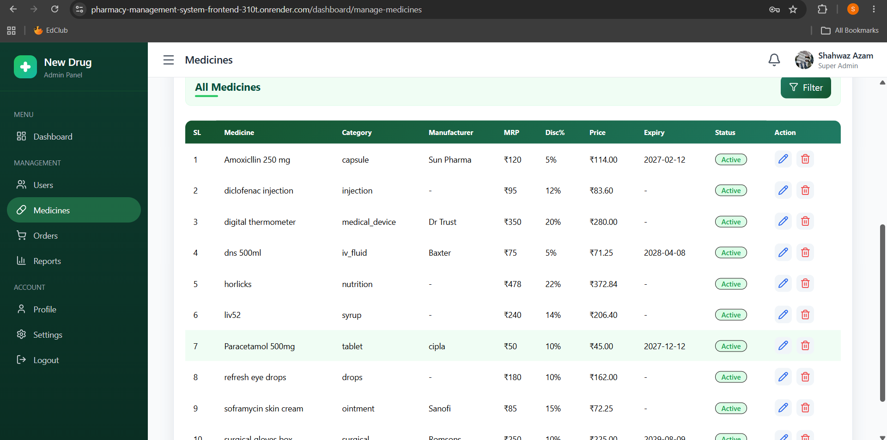
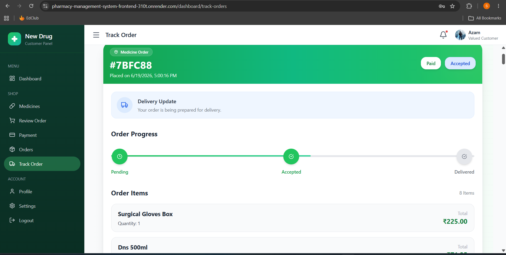
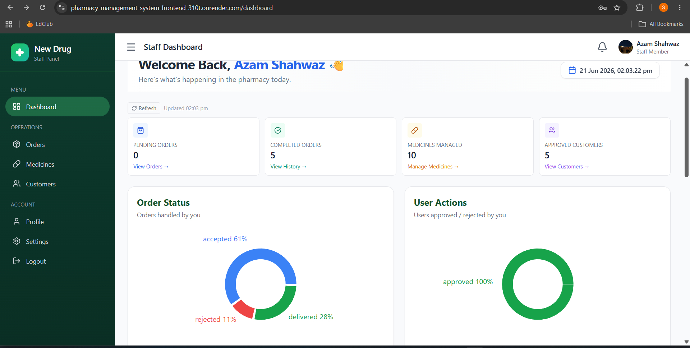

# New Drug — Pharmacy Management System

A full-stack **Pharmacy Management System** built using the **MERN Stack** (MongoDB, Express.js, React.js, Node.js) to streamline pharmacy operations, medicine inventory, customer ordering, payments, and role-based administrative control.

🔗 **Live Demo:** [https://pharmacy-management-system-frontend-310t.onrender.com](https://pharmacy-management-system-frontend-310t.onrender.com)

📂 **Repository:** [https://github.com/azamshahwaz/Pharmacy-management-system](https://github.com/azamshahwaz/Pharmacy-management-system)

## 📸 Screenshots

### Login Page

### Admin Dashboard

### Medicines Management

### Order Tracking

### Staff Dashboard

## 📖 About the Project

New Drug is a role-based pharmacy management platform designed to digitize medicine inventory, order processing, and customer interactions. It supports three distinct roles — **Admin, Staff, and Customer** — each with tailored dashboards, permissions, and workflows. The system was built and deployed end-to-end, including handling real production challenges like email service migration, cold-start mitigation, and secure payment integration.

## ✨ Features

### 🛠️ Admin
- Manage medicines (add/update/delete inventory)
- Manage staff and customer accounts
- Approve or reject staff/customer signup requests
- View and manage all orders across the platform
- Block/unblock and soft delete/restore user accounts
- Role management and permission control
- Real-time analytics dashboard (Recharts) — revenue, orders, user growth
- Real-time notification system for account/order activity

### 👨‍💼 Staff
- Manage medicine inventory
- Process and update customer order statuses
- Assist customers with order-related queries
- View role-specific dashboard statistics
- Receive real-time notifications for new orders

### 🧑‍💻 Customer
- Browse available medicines with search/filter
- Add medicines to cart and place orders
- Track real-time order status
- Manage profile and saved delivery addresses
- Complete secure online payments via Razorpay
- Receive order/account notifications

## 🔐 Authentication & Verification

The system uses secure, OTP-based email authentication:

1. User signs up with an email address.
2. A one-time verification code (OTP) is generated and sent via email (Brevo SMTP).
3. User enters the OTP to verify their account.
4. Account is created and awaits Admin/Staff approval.
5. Once approved, the user gains full access to role-specific features.

**Auth implementation details:**
- JWT-based authentication stored in **HttpOnly cookies** (prevents XSS-based token theft)
- Role-Based Access Control (RBAC) middleware on protected routes
- Secure password hashing (bcrypt)

## 🏗️ System Workflow

1. Admin logs in
2. Admin creates/manages Staff accounts
3. Admin/Staff approve Customer signups
4. Admin/Staff manage medicine inventory
5. Customers browse medicines and place orders
6. Staff/Admin process orders and update status
7. Customers track orders and complete payment
8. Real-time notifications keep all roles updated

## ⚙️ Tech Stack

### Frontend
- React.js (Vite)
- Tailwind CSS + DaisyUI
- React Router
- Axios
- Recharts (analytics visualization)

### Backend
- Node.js + Express.js
- MongoDB + Mongoose (MongoDB Atlas)
- JWT Authentication
- Razorpay (payment gateway integration)
- Brevo SMTP (transactional email & OTP delivery)

### DevOps / Infrastructure
- Render (deployment — free tier)
- UptimeRobot (uptime monitoring + cold-start mitigation via `/health` endpoint pinging)

## 🛡️ Security Features

- Email verification with OTP
- JWT authentication via HttpOnly cookies
- Role-Based Access Control (RBAC)
- Protected API routes via auth middleware
- Secure password hashing (bcrypt)
- Environment variable protection (no secrets committed)
- Input validation on all forms

## 📈 Key Engineering Highlights

- Migrated email service (Gmail SMTP → Resend → Brevo) to work around Render's outbound port restrictions
- Implemented cold-start mitigation using scheduled health checks to keep the free-tier server warm
- Used fire-and-forget async patterns for non-blocking DB writes and email dispatch during signup/login
- Built a reusable, role-aware `StatsCards` component for consistent analytics UI across dashboards
- Fixed cross-page data consistency issues between Dashboard, Reports, and Orders views

## 📄 License

This project is developed for educational and learning purposes.

## 🙋 Author

**Shahwaz Azam**

🔗 [LinkedIn](https://linkedin.com/in/shahwaz-azam)

💻 [GitHub](https://github.com/azamshahwaz)

## 💬 Support

For questions, bug reports, or feature requests, please open an issue in this repository.