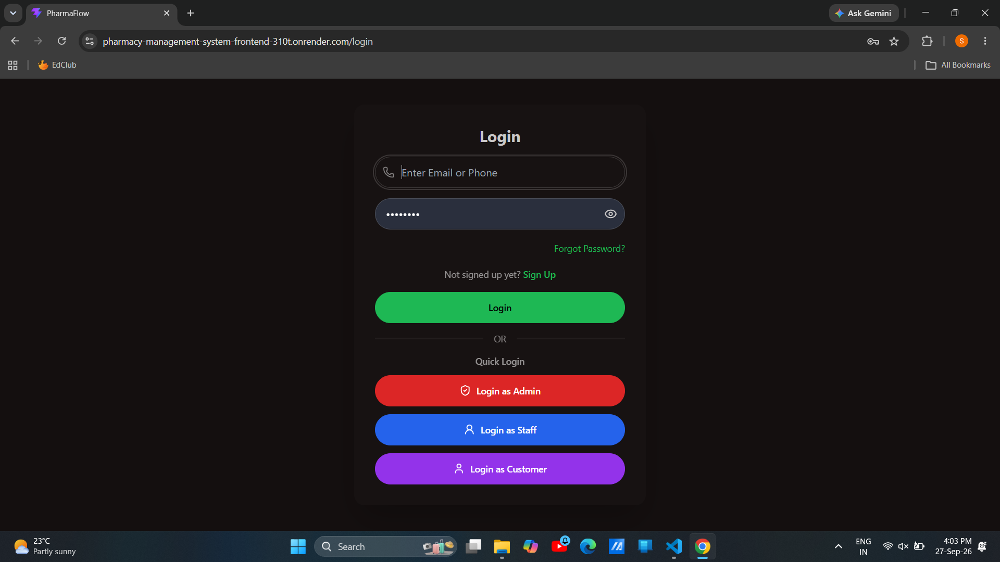
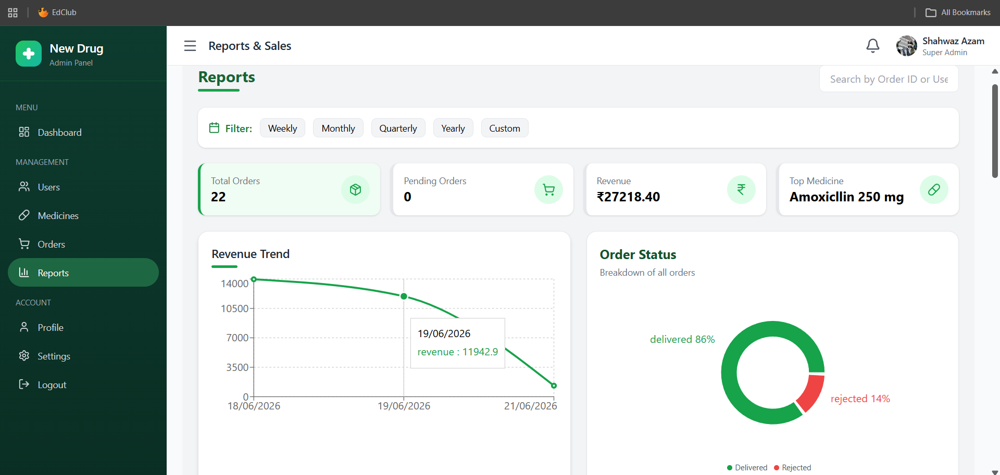
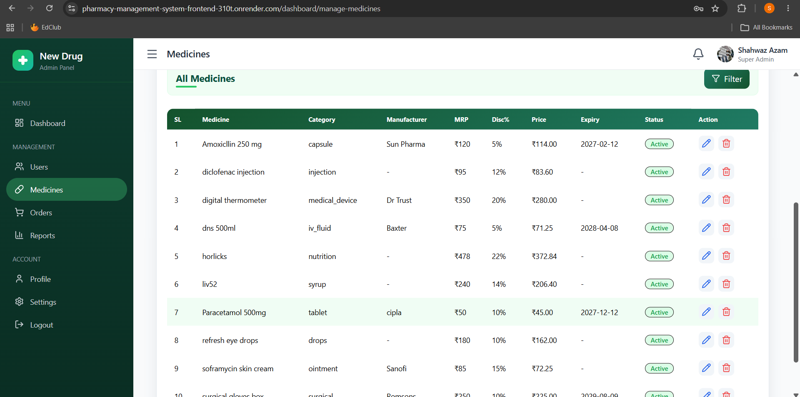
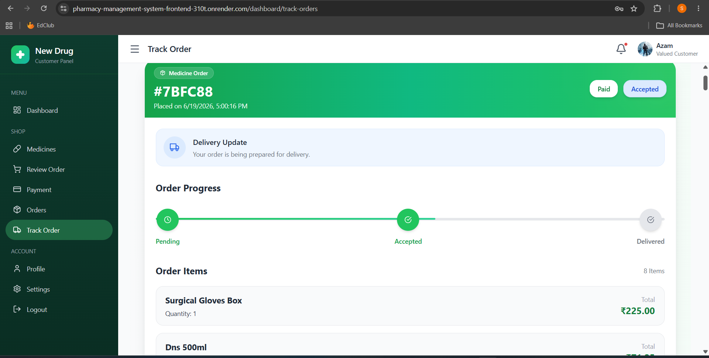
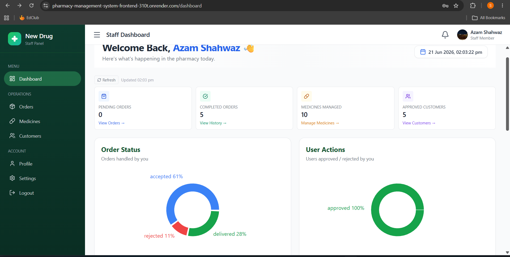
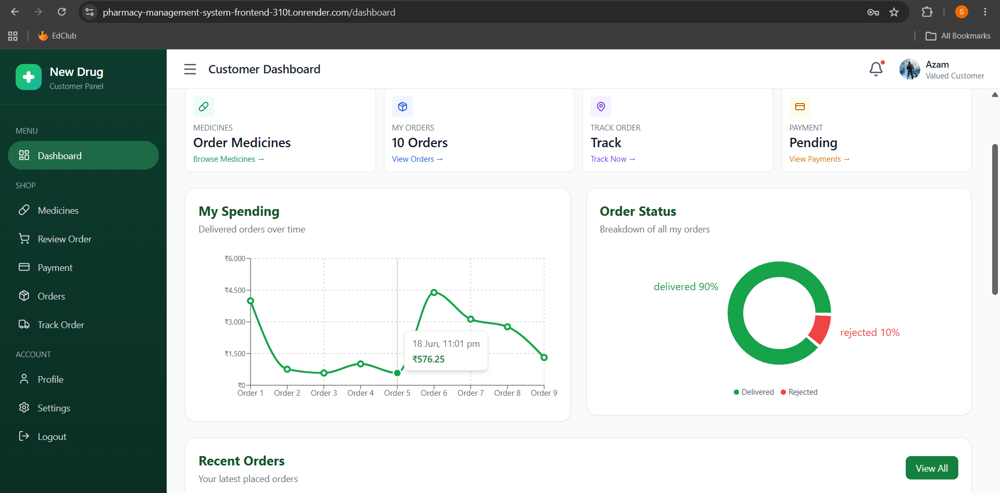

# 💊 PharmaFlow — Pharmacy Management System

A full-stack **Pharmacy Management System** built using the **MERN Stack** — MongoDB, Express.js, React.js, and Node.js.

The application provides a role-based platform for managing pharmacy users, medicines, customer orders, payments, approvals, notifications, and administrative operations.

It supports three major user roles:

* 🛠️ **Admin**
* 👨‍💼 **Staff**
* 🧑‍💻 **Customer**

The system is fully deployed and includes secure authentication, role-based authorization, OTP email verification, online payments, analytics dashboards, notifications, and production-oriented security measures.

---

## 🔗 Live Demo

🌐 **Live Application:**
https://pharmacy-management-system-frontend-310t.onrender.com

💻 **GitHub Repository:**
https://github.com/azamshahwaz/Pharmacy-management-system

### 🚀 Quick Login

To make the project easier to evaluate, especially for recruiters and reviewers, the login page provides dedicated buttons for:

* **Login as Admin**
* **Login as Staff**
* **Login as Customer**

This allows users to quickly explore the different role-specific dashboards and functionalities without manually going through the complete account creation process.

> The quick-login options are provided for demonstration and project evaluation purposes.

---

# 📸 Screenshots

## 🔐 Login Page



The login page supports role-based authentication along with quick-login options for directly exploring the Admin, Staff, and Customer experiences.

---

## 🛠️ Admin Dashboard



The Admin dashboard provides an overview of platform activity, users, orders, revenue, and other operational statistics.

---

## 💊 Medicines



Customers can browse available medicines and search/filter through the medicine catalog.

---

## 📦 Order Tracking



Customers can monitor their orders while Admin and Staff can process and update order statuses.

---

## 👨‍💼 Staff Dashboard



The Staff dashboard provides role-specific access to customer orders, medicines, and operational activities.

---

## 👤 Customer Dashboard



---

# 📖 About the Project

**PharmaFlow** is a role-based pharmacy management platform designed to digitize common pharmacy workflows such as:

* User registration and verification
* Admin approval workflows
* Medicine catalog management
* Customer medicine browsing
* Cart and order management
* Order processing
* Online payments
* User account management
* Notifications
* Analytics and reporting

The application follows a **role-based architecture**, where each user receives access to features according to their role.

The project was developed as a complete full-stack application, including frontend, backend, database integration, authentication, payment integration, email services, security middleware, deployment, and production debugging.

---

# 👥 User Roles

The application is divided into three primary roles.

| Role           | Main Responsibilities                                                   |
| -------------- | ----------------------------------------------------------------------- |
| 🛠️ Admin      | Platform administration, users, approvals, medicines, orders, analytics |
| 👨‍💼 Staff    | Order processing, medicine-related operations, customer assistance      |
| 🧑‍💻 Customer | Browse medicines, cart, orders, payments, profile management            |

Each role has its own dashboard and protected routes.

---

# ✨ Features

## 🛠️ Admin Features

* Admin authentication
* Admin dashboard
* Manage medicines
* Add, update, and remove medicine records
* Manage Staff accounts
* Manage Customer accounts
* Approve or reject user requests
* Block/unblock users
* Soft delete and restore accounts
* Role-based access management
* View and manage customer orders
* Update order status
* View analytics and reports
* Revenue and order statistics
* User growth statistics
* Dashboard statistics using Recharts
* Receive notifications for important account/order activities

---

## 👨‍💼 Staff Features

* Staff authentication
* Staff-specific dashboard
* View available medicines
* Manage medicine-related operations
* View customer orders
* Process customer orders
* Update order status
* Assist with customer order-related activities
* View role-specific statistics
* Receive notifications for new orders and relevant activities

---

## 🧑‍💻 Customer Features

* Customer registration
* Email verification through OTP
* Customer login
* Browse available medicines
* Search medicines
* Filter medicines
* View medicine details
* Add medicines to cart
* Manage cart
* Place orders
* View order history
* Track order status
* Manage profile
* Manage saved delivery addresses
* Secure online payment through Razorpay
* Receive order/account notifications

---

# 🔐 Authentication & Authorization

The application implements a secure authentication and authorization system.

### Authentication Flow

```text
User Registration
       ↓
Email + Password
       ↓
OTP Generated
       ↓
OTP Sent via Email
       ↓
Email Verification
       ↓
Account Created
       ↓
Admin/Staff Approval
       ↓
User Login
       ↓
JWT Authentication
       ↓
Role-Based Dashboard
```

### Authentication Features

* OTP-based email verification
* JWT-based authentication
* JWT stored in **HttpOnly cookies**
* Secure password hashing using bcrypt
* Protected API routes
* Role-Based Access Control (RBAC)
* Authentication middleware
* Authorization middleware
* Secure logout
* Session validation through authenticated API requests

Using HttpOnly cookies helps prevent client-side JavaScript from directly accessing authentication tokens.

---

# 🔑 Role-Based Access Control

The application uses **RBAC (Role-Based Access Control)** to restrict access to different features.

Example:

```text
                ┌───────────────┐
                │   User Login  │
                └───────┬───────┘
                        │
                        ▼
                ┌───────────────┐
                │ Authentication│
                └───────┬───────┘
                        │
              ┌─────────┼─────────┐
              ▼         ▼         ▼
           Admin      Staff    Customer
              │         │         │
              ▼         ▼         ▼
          Admin UI   Staff UI  Customer UI
```

Backend middleware validates the authenticated user's role before allowing access to protected resources.

---

# 💳 Payment Integration

The application integrates **Razorpay** for online customer payments.

### Payment Flow

```text
Customer
   ↓
Add Medicine to Cart
   ↓
Place Order
   ↓
Proceed to Payment
   ↓
Razorpay Checkout
   ↓
Payment Processing
   ↓
Payment Verification
   ↓
Order Confirmation
```

This provides a complete customer ordering and payment workflow.

---

# 📧 Email & OTP System

Email functionality is implemented for account verification and transactional communication.

### Email Service

**Brevo SMTP** is used for sending emails.

The system supports:

* OTP generation
* OTP email delivery
* Email verification
* Account-related notifications
* Transactional email communication

During deployment, the email service was migrated between providers to address production environment restrictions.

---

# 🔔 Notification System

The application includes a notification system for important account and order activities.

Notifications are used for events such as:

* New orders
* Order status updates
* Account-related activities
* Approval-related activities
* Other relevant system events

This helps keep Admin, Staff, and Customers informed about important changes.

---

# 📊 Analytics & Dashboard

The Admin dashboard includes visual analytics using **Recharts**.

The dashboard can provide insights such as:

* Revenue
* Order statistics
* User growth
* Platform activity
* Role-specific statistics

Reusable dashboard components were created to maintain consistency across different role-based dashboards.

---

# 🏗️ System Workflow

```text
                    ┌──────────────┐
                    │     Admin    │
                    └──────┬───────┘
                           │
              ┌────────────┼────────────┐
              │            │            │
              ▼            ▼            ▼
          Users       Medicines      Orders
              │            │            │
              │            │            │
              └────────────┼────────────┘
                           │
                           ▼
                    ┌──────────────┐
                    │    Customer  │
                    └──────┬───────┘
                           │
                     Browse Medicines
                           │
                           ▼
                         Cart
                           │
                           ▼
                        Order
                           │
                           ▼
                       Razorpay
                           │
                           ▼
                    Payment Success
                           │
                           ▼
                    Order Processing
                           │
                           ▼
                    Order Tracking
```

---

# 🧩 Application Architecture

The project follows a typical MERN full-stack architecture.

```text
┌───────────────────────────────────────────────┐
│                   Frontend                    │
│                                               │
│ React + Vite + Tailwind CSS + DaisyUI         │
│ React Router + Axios + Recharts               │
└───────────────────────┬───────────────────────┘
                        │
                        │ REST API
                        ▼
┌───────────────────────────────────────────────┐
│                   Backend                     │
│                                               │
│ Node.js + Express.js                          │
│ Authentication + RBAC + Business Logic       │
│ Security Middleware + API Routes              │
└───────────────────────┬───────────────────────┘
                        │
                        ▼
┌───────────────────────────────────────────────┐
│                  Database                     │
│                                               │
│ MongoDB Atlas + Mongoose                      │
└───────────────────────────────────────────────┘

External Services
───────────────────────────────────────────────
Razorpay → Online Payments
Brevo     → Email / OTP
Cloudinary → Media/File Storage
Render    → Deployment
UptimeRobot → Uptime Monitoring
```

---

# ⚙️ Tech Stack

## Frontend

* **React.js**
* **Vite**
* **Tailwind CSS**
* **DaisyUI**
* **React Router**
* **Axios**
* **Recharts**
* **Lucide React**
* **React Toastify**

---

## Backend

* **Node.js**
* **Express.js**
* **MongoDB**
* **Mongoose**
* **JWT**
* **bcrypt**
* **Cookie Parser**
* **Multer**
* **Cloudinary**
* **Razorpay**
* **Brevo SMTP**
* **Winston**

---

## Security & Middleware

* **Helmet**
* **CORS**
* **Express Rate Limit**
* **Cookie Parser**
* **Compression**
* **MongoDB/Mongoose validation**
* **Authentication middleware**
* **Role-based authorization middleware**
* **Secure HttpOnly cookies**
* **Password hashing**
* **Environment variables**

---

## Deployment & Infrastructure

* **Render** — Application deployment
* **MongoDB Atlas** — Cloud database
* **UptimeRobot** — Uptime monitoring
* **Cloudinary** — Cloud media storage
* **Brevo** — Transactional email service
* **Razorpay** — Payment gateway

---

# 🛡️ Security Features

Security was considered throughout the application rather than being limited to authentication.

### Implemented Security Measures

* 🔐 JWT authentication
* 🍪 HttpOnly authentication cookies
* 🔑 bcrypt password hashing
* 🛡️ Helmet security headers
* 🚦 API rate limiting
* 🌐 CORS configuration
* 🔒 Protected API routes
* 👥 Role-Based Access Control
* 📧 OTP-based email verification
* 🔑 Environment variable protection
* 🚫 Secrets excluded from Git
* ✅ Server-side authentication checks
* ✅ Input validation
* 🗑️ Soft deletion for selected user records
* 🔄 Account restore functionality
* 📝 Logging using Winston

---

# 🚀 Production & Deployment Highlights

One of the main goals of this project was to understand how a full-stack application behaves beyond local development.

Several production-related challenges were handled during deployment.

### 📧 Email Service Migration

The email system went through multiple iterations:

```text
Gmail SMTP
     ↓
Render SMTP restrictions / connectivity issues
     ↓
Resend
     ↓
Brevo SMTP
```

The final implementation uses **Brevo SMTP** for transactional emails and OTP delivery.

---

### 💤 Render Cold Starts

Since the application is deployed using Render's free-tier infrastructure, the backend can experience cold starts after periods of inactivity.

To reduce this issue:

```text
UptimeRobot
     ↓
Scheduled Health Check
     ↓
/health Endpoint
     ↓
Backend Remains Active
```

A dedicated health endpoint is used for uptime monitoring.

---

### 🍪 Authentication Migration

The authentication architecture was improved from client-side token handling to cookie-based authentication.

### Earlier approach

```text
Login
 ↓
JWT
 ↓
localStorage
```

### Current approach

```text
Login
 ↓
JWT
 ↓
HttpOnly Cookie
 ↓
Authenticated API Requests
```

This reduces the exposure of authentication tokens to client-side JavaScript.

---

# 🧠 Key Engineering Highlights

Some of the main engineering challenges and improvements implemented in the project include:

### 1. Role-Based Architecture

Implemented separate experiences for:

* Admin
* Staff
* Customer

with both frontend route protection and backend authorization.

---

### 2. Secure Cookie-Based Authentication

Migrated authentication from localStorage-based token handling to **HttpOnly cookie-based JWT authentication**.

---

### 3. OTP Verification

Implemented email OTP verification as part of the registration flow.

---

### 4. Payment Integration

Integrated Razorpay to support online customer payments.

---

### 5. Notification System

Implemented role-aware notifications for order and account-related activities.

---

### 6. Reusable Dashboard Components

Built reusable dashboard components such as statistics cards to maintain consistency across Admin and Staff dashboards.

---

### 7. API Versioning

Backend APIs are structured using versioned routes:

```text
/api/v1/...
```

This provides a cleaner structure for future API evolution.

---

### 8. Production Security Hardening

Added production-oriented middleware including:

```text
Helmet
CORS
Rate Limiting
Compression
Cookie Parser
Winston Logging
```

---

### 9. Cross-Page Data Consistency

Worked on maintaining consistent data across:

* Dashboard
* Reports
* Orders
* User management
* Medicine views

so that updates made in one part of the application are correctly reflected in other relevant views.

---

# 📁 Project Structure

```text
Pharmacy-management-system/
│
├── frontend/
│   ├── src/
│   │   ├── components/
│   │   ├── pages/
│   │   ├── layouts/
│   │   ├── context/
│   │   ├── services/
│   │   ├── hooks/
│   │   └── App.jsx
│   │
│   ├── public/
│   ├── package.json
│   └── vite.config.js
│
├── backend/
│   ├── config/
│   ├── controllers/
│   ├── middleware/
│   ├── models/
│   ├── routes/
│   ├── services/
│   ├── utils/
│   ├── server.js
│   └── package.json
│
├── Screenshots/
│   ├── Login.png
│   ├── AdminReports.png
│   ├── AllMedicinesList.png
│   ├── OrderTracking.png
│   └── StaffDashboard.png
│
├── .gitignore
└── README.md
```

> Folder names may vary slightly depending on the current implementation.

---

# 🔄 Example User Journey

## Customer

```text
Login as Customer
       ↓
Customer Dashboard
       ↓
Browse Medicines
       ↓
Search / Filter
       ↓
Add to Cart
       ↓
Place Order
       ↓
Razorpay Payment
       ↓
Order Confirmation
       ↓
Track Order
```

---

## Staff

```text
Login as Staff
       ↓
Staff Dashboard
       ↓
View Orders
       ↓
Process Customer Orders
       ↓
Update Order Status
       ↓
Customer Receives Update
```

---

## Admin

```text
Login as Admin
       ↓
Admin Dashboard
       ↓
Manage Users
       ↓
Manage Medicines
       ↓
Manage Orders
       ↓
View Analytics
       ↓
Handle Approvals / Account Actions
```

---

# 🌐 Deployment

The application is deployed on **Render**.

### Frontend

```text
React + Vite
        ↓
Render
        ↓
Production Frontend
```

### Backend

```text
Node.js + Express
        ↓
Render
        ↓
Production REST API
```

### Database

```text
MongoDB
    ↓
MongoDB Atlas
```

### External Services

```text
Razorpay  → Payments
Brevo     → OTP / Emails
Cloudinary → Media Storage
UptimeRobot → Monitoring
```

---

# 🔧 Environment Variables

Environment variables are used to keep sensitive configuration outside the source code.

Example backend configuration:

```env
PORT=5000
MONGO_URI=your_mongodb_connection_string

JWT_SECRET=your_jwt_secret

CLIENT_URL=your_frontend_url

RAZORPAY_KEY_ID=your_razorpay_key
RAZORPAY_KEY_SECRET=your_razorpay_secret

BREVO_SMTP_HOST=your_smtp_host
BREVO_SMTP_PORT=your_smtp_port
BREVO_SMTP_USER=your_smtp_user
BREVO_SMTP_PASSWORD=your_smtp_password

CLOUDINARY_CLOUD_NAME=your_cloud_name
CLOUDINARY_API_KEY=your_api_key
CLOUDINARY_API_SECRET=your_api_secret
```

> Actual credentials are never committed to the repository.

---

# 💻 Running the Project Locally

## 1. Clone the Repository

```bash
git clone https://github.com/azamshahwaz/Pharmacy-management-system.git

cd Pharmacy-management-system
```

---

## 2. Install Backend Dependencies

```bash
cd backend
npm install
```

---

## 3. Configure Backend Environment Variables

Create a `.env` file inside the backend directory and add the required environment variables.

---

## 4. Start Backend

```bash
npm run dev
```

The backend will run on the configured port.

---

## 5. Install Frontend Dependencies

Open another terminal:

```bash
cd frontend
npm install
```

---

## 6. Configure Frontend

Create the required environment file and configure the backend API URL.

Example:

```env
VITE_API_URL=http://localhost:5000/api/v1
```

---

## 7. Start Frontend

```bash
npm run dev
```

The frontend will then be available through the Vite development server.

---

# 📌 API Architecture

The backend follows a RESTful API structure with versioned endpoints.

Example:

```text
/api/v1/auth
/api/v1/users
/api/v1/admin
/api/v1/medicines
/api/v1/orders
```

Requests are protected using authentication and role-based authorization middleware wherever required.

---

# 🧪 Development Challenges Solved

During development and deployment, the project involved solving several real-world problems, including:

* MongoDB connection configuration
* Authentication state persistence
* JWT cookie handling
* CORS configuration
* Role-based route protection
* OTP email delivery
* SMTP connectivity issues
* Payment gateway integration
* Render deployment issues
* Free-tier cold starts
* API versioning
* Cross-page data synchronization
* Secure environment variable management
* Production middleware configuration
* User account lifecycle management

These challenges helped move the project beyond a basic CRUD application toward a more production-oriented full-stack system.

---

# 📚 What This Project Demonstrates

This project demonstrates practical experience with:

* Full-stack MERN development
* REST API development
* React application architecture
* Node.js & Express.js
* MongoDB & Mongoose
* Authentication & authorization
* JWT & HttpOnly cookies
* RBAC
* OTP verification
* Payment gateway integration
* Email services
* Cloud deployment
* API security
* Rate limiting
* Logging
* Database operations
* Responsive UI development
* Dashboard analytics
* Production debugging
* Third-party API integrations

---

# 🎯 Future Improvements

Possible future enhancements include:

* Advanced order analytics
* More detailed reporting
* Automated invoice generation
* Enhanced notification preferences
* Advanced search and filtering
* More granular permission management
* Automated testing
* CI/CD pipeline
* Additional monitoring and observability
* Improved mobile responsiveness

---

# 📄 License

This project was developed for **educational and learning purposes**.

---

# 👨‍💻 Author

## Shahwaz Azam

🎓 B.Tech — Computer Science & Engineering (Data Science)

💻 **GitHub:**
https://github.com/azamshahwaz

🔗 **LinkedIn:**
https://linkedin.com/in/shahwaz-azam

---

# 💬 Support

If you find a bug, have a suggestion, or want to discuss the project, feel free to open an issue in the GitHub repository.

⭐ If you find this project useful, consider giving the repository a star!
